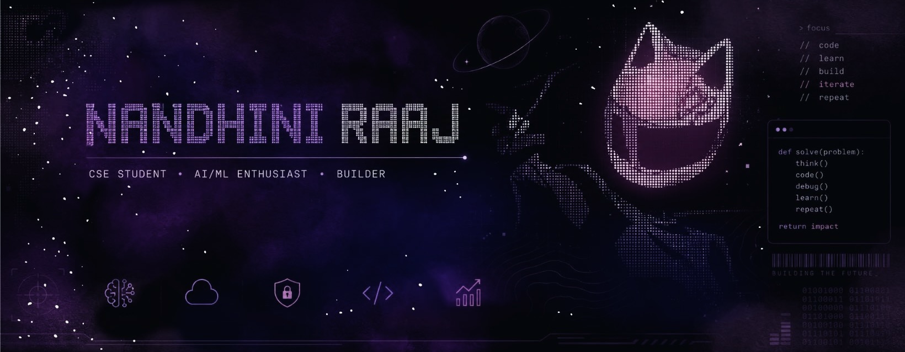

  

<h2>About</h2>

I'm a CS student at VIT Chennai interested in building things at the intersection of
<strong>AI/ML, intelligent systems, and software engineering</strong>.
I enjoy exploring ideas through research and hands-on projects, especially around
<strong>reinforcement learning and agentic systems</strong>.
Currently, I'm diving deeper into <strong>open source and production-grade ML</strong>,
while looking for interesting problems to build around.

 

## Interests & Currently

> Exploring **AI agents, reinforcement learning & production-grade ML systems**  
> Diving deeper into **open source, LangChain/LangGraph & intelligent systems**  
> Interested in **AI/ML, systems, cybersecurity & software engineering**  
> Exploring research in **reinforcement learning & agentic systems**  
> Open to **SDE / AI-ML internship opportunities**

 

## Tech & Tools

### Languages

  
  
  
  

### AI / ML

  
  
  
  

### Tools & Platforms

  
  
  
  
  

## Research & Publications

**Cross-Layer Reinforcement Learning for Energy-Aware Resource Management in IoT Gateway Systems**  
*ICPSCN 2026 · Co-author*

Research applying reinforcement learning across network layers to improve energy-aware resource management in IoT gateway systems.

**Benchmarking Variational Quantum Regressors Against Classical Linear Models for Solar Power Forecasting**  
*RAEEUCCI 2026 · First author*

A comparative study of variational quantum regression models and classical linear models for solar power forecasting.
## Contributions

<picture>
  <source
    media="(prefers-color-scheme: dark)"
    srcset="https://raw.githubusercontent.com/nandhiniraaj/nandhiniraaj/output/github-contribution-grid-snake-dark.svg">

  <source
    media="(prefers-color-scheme: light)"
    srcset="https://raw.githubusercontent.com/nandhiniraaj/nandhiniraaj/output/github-contribution-grid-snake.svg">

  

</picture>

